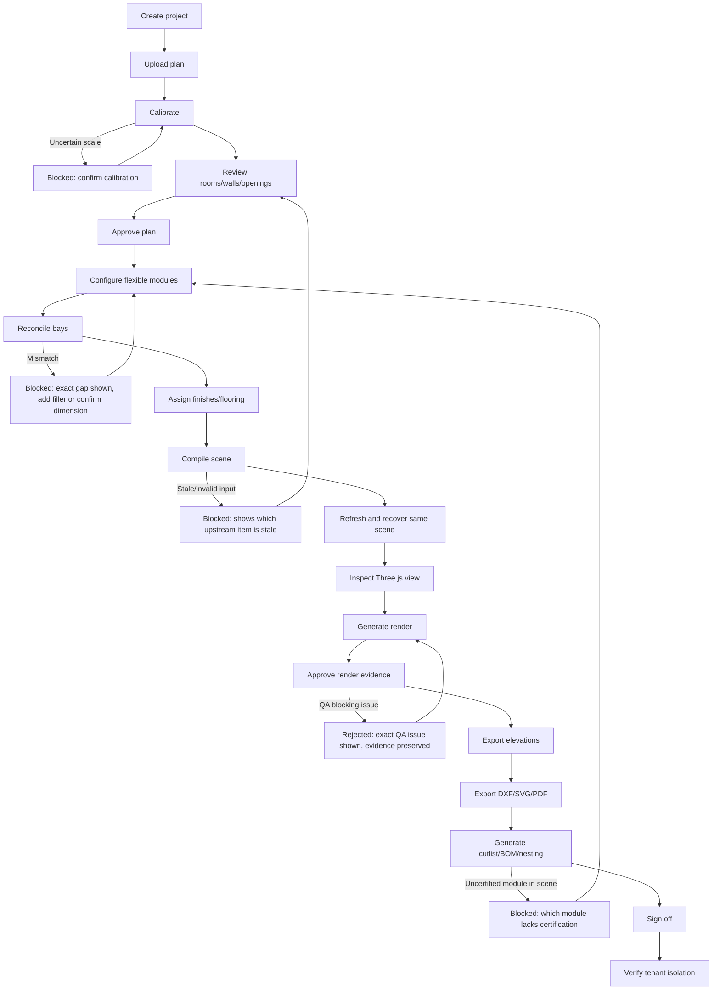

# ULTIDA — Floorplan Detection, Render QA Wiring & Enhanced User Flow
2026-09-07, third pass. Verified against live code again — two new concrete findings below that change your priority order.

---

## 0. Two new verified findings

**Finding A — your Phase 7 "Render QA" checklist is more built than the last report suggested, but it's dead code.**
`packages/render-pipeline/src/qa.ts` (105 lines) is real, non-stub logic: it checks wall-edge alignment, door/window count, module-box presence, cabinet-division count, camera deviation (mm), missing objects, invented objects, and material-region coverage — genuinely close to your Phase 7 spec. But it's only ever imported by `packages/render-pipeline/src/job.ts` — and `apps/api/src/visual-jobs.ts` (the file actually wired to the live render endpoint) never imports `runRenderQA` at all. This is the exact "unused abstraction" trap your own backlog already named for this same `job.ts` file. **Don't build new render QA — wire up the QA you already have.** That's a much smaller task than it looked like yesterday.

**Finding B — the wall detector uses fixed pixel thresholds, which is very likely your "doesn't detect super properly" complaint.**
In `apps/api/cv/wall_tracer.py`:
```python
lines = cv2.HoughLinesP(binary, rho=1, theta=np.pi/180, threshold=60, minLineLength=40, maxLineGap=8)
```
`threshold=60`, `minLineLength=40`, `maxLineGap=8` are **pixel values with no DPI normalization**. A 300-DPI scanned plan and a 72-DPI phone photo of the same drawing produce wall lines that differ in pixel length by ~4x — one fixed threshold cannot be right for both. This is the single highest-leverage fix for "detect super properly," ahead of anything else in this doc. The good news: the file already has solid foundations to build on — angle-snapping (`snap_to_axis`, 6° tolerance) and real parallel-line thickness pairing (`estimate_thickness_and_dedupe`) both exist and are not fake. This isn't a rewrite, it's a normalization pass.

---

## 1. Floor plan analyzer — concrete detection improvements, in priority order

### 1. DPI/scale normalization before any Hough call (fixes Finding B)
Before line detection, resample every input to a **fixed reference resolution** (e.g. normalize so the longest image dimension is always ~2400px, or better, read actual DPI from the file — PDFs and many scanned TIFFs carry it) and scale every pixel-based parameter (`threshold`, `minLineLength`, `maxLineGap`, and the `estimate_thickness_and_dedupe` pairing distances) proportionally to that normalization. Concretely:
```python
REFERENCE_LONG_EDGE_PX = 2400
scale_factor = REFERENCE_LONG_EDGE_PX / max(img.shape[:2])
# resize to reference resolution, then use FIXED thresholds calibrated at that resolution
# convert detected pixel geometry back to original-image pixels afterward for downstream calibration
```
This turns "one set of magic numbers that sort of works" into "one set of magic numbers calibrated once, at one resolution, that always applies." Test with your existing golden dataset idea (§ below) across at least one high-DPI scan and one low-res phone photo of the *same* plan to confirm results converge.

### 2. Multi-pass detection instead of one Hough call
Right now it looks like a single Hough pass on one binarized image. Real plans vary a lot in line weight and contrast. Run detection at 2-3 preprocessing variants and merge/vote:
- Pass 1: current adaptive-threshold + morphological close (already implemented).
- Pass 2: Canny edge detection feeding the same Hough call (different failure mode — better on thin/light lines, worse on filled wall hatching).
- Merge: a wall segment confirmed by both passes gets higher confidence; a segment found by only one gets flagged for review rather than silently dropped or silently trusted (matches your rule: "unconfirmed values must be marked, not guessed").

### 3. Adaptive parameters based on detected line density, not just fixed values
After the first pass, check how many line segments were found. If far too few (likely a very light/thin-line CAD export) or far too many (likely a noisy scan with furniture/text), do a second pass with adjusted `threshold`/`minLineLength` rather than accepting a bad first result. This is a cheap, high-value addition to the existing pipeline.

### 4. Reconcile CV + OCR + vision explicitly (already scoped, now sequenced against Finding B)
Your `reconcile_plan.ts` file already exists under `ENHANCMENTS/ultida-flow-kit/server/` — before writing new reconciliation logic, check whether it's wired into `apps/api/src/index.ts`'s plan-analysis route or sitting unused like `job.ts`/`qa.ts` were. If unused, wiring it in is a smaller, safer task than writing new reconciliation from scratch. Verify with:
```bash
grep -rn "reconcile_plan\|reconcilePlan" apps/api/src/
```
If that returns nothing, it's dead code — same pattern as Finding A, now twice-confirmed as a recurring issue across your codebase: **good logic gets written, then never wired into the live path.** This should become a standing check for every future "feature complete" claim: grep the actual live route file, not just the package that defines the logic.

### 5. Confidence + source tagging on every detected element (per your Phase 2 spec)
Every wall/room/opening/dimension needs `{ source: 'cv' | 'ocr' | 'vision' | 'manual', confidence: number, verified: boolean }`. This already partially exists (`confidence` fields visible in `wall_tracer.py`'s thickness pairing), extend it consistently through rooms/openings/dimensions and surface it in the review overlay UI so a human sees exactly which parts are shaky.

### 6. Golden dataset — do this in parallel, not after
You don't need to wait for 1-5 to be "done" to start this. Collect 5 real plans now (clean vector PDF, scanned/noisy, rotated ≥10°, dense-labeled, one with intentionally missing/ambiguous scale) and hold them out from any tuning. Score wall precision/recall and calibrated length error after each of the 5 changes above, so you can actually tell whether "detect super properly" is improving, instead of eyeballing one demo plan repeatedly.

**Sequencing: 1 → 6 (parallel) → 2 → 3 → 4 → 5.** Item 1 alone (DPI normalization) is likely to produce the most visible improvement for the least work — do it first and re-run your golden set before investing in 2-4.

---

## 2. Flooring — no change from the prior plan, just a reminder of build order

Already fully specified in the previous doc (`ULTIDA-furniture-library-and-roadmap.md`, §4 of the completion plan): `FloorSurfaceV1` contract → compiler clipping against real room polygons → same tile-layout calculation feeding 3D/plan/quantities → UI under Finishes → copy-to-selected-rooms with impact preview. Nothing in today's scan changes that sequence. The one addition: once flooring contracts exist, extend Finding B's confidence/source tagging to floor region detection too, if you ever auto-detect flooring boundaries from the plan image rather than deriving them purely from the room polygon (recommend deriving from the room polygon only, at least initially — it's more reliable than re-doing CV work for a boundary you already have from the approved room shape).

---

## 3. Wire up the render QA you already built (Finding A — do this, don't rebuild)

Concrete task for Codex:
1. In `apps/api/src/visual-jobs.ts`, after `renderScenePerspectiveArtifacts` produces the deterministic base render and before an AI-enhanced render is marked `approved`/returned to the client, call `runRenderQA(expectation, measured, geometryLock)` from `@ultida/render-pipeline`.
2. `expectation: SceneExpectation` should be built directly from the approved `scene.v1` (wall/door/window/module counts, camera, expected object IDs, material region IDs) — this data already exists in the compiled scene, it just needs mapping into the QA input shape.
3. `measured: MeasuredResult` is the one genuinely new piece of work — you need an actual measurement pass (vision-based object/edge detection on the output image) to populate `wallEdgesAligned`, `measuredDoorCount`, `measuredObjectIds`, etc. This is real, non-trivial work; don't fake it with `wallEdgesAligned: true` as a placeholder, since your own rule 6 explicitly forbids treating an AI render as verified construction evidence without real checking.
4. Gate the existing "approved" state transition in `visual-jobs.ts` on `issues.filter(i => i.severity === 'blocking').length === 0` from the QA result.
5. Test: feed a render with a deliberately moved door into the pipeline, confirm it's blocked with the QA's own message ("Door count mismatch...").

This is a much smaller, more concrete task than "build render QA from scratch" — you already paid for the logic, you just haven't spent it yet.

---

## 4. Your enhanced user flow

Your flow is good and matches the architecture correctly. Two additions worth making explicit, both about **failure and resume paths**, since a flow diagram that only shows the happy path hides exactly the states your own five-state UI contract requires:



What this adds over your version, and why each matters:
- **Calibration and bay-reconciliation loops feed back to the exact step that needs fixing**, not to "start over." Per your own UX spec, a failed action should preserve the draft and focus the conflict, not force the user to re-walk the whole flow.
- **Compile can fail on stale upstream data** — if a room's plan was edited after a module was placed, compile should say which room is stale, not just "compile failed."
- **Render approval can be rejected by QA (once §3 is wired up)** and loop back to regenerate — this is the step your flow currently shows as one-directional ("approve render evidence") when in reality it's the most likely rejection point in the whole pipeline.
- **Cutlist generation can be blocked by an uncertified module** — this is the enforcement point for your module-certification rule ("decorative proxies cannot enter a cutlist"), and it should be visible in the flow, not just a background compiler check.

One structural suggestion beyond the diagram: **make "Refresh and recover same scene" a check that runs automatically at every step transition, not just its own named step.** Concretely, every screen transition (room→room, tab→tab, even browser refresh) should re-fetch the current persisted scene state and diff it against what's on screen, so "did my last edit actually save" is never ambiguous. This is implied by your IA spec ("Room, wall, camera and selected component survive tab changes and refresh") but making it a first-class cross-cutting behavior rather than a per-screen concern will save you from re-solving the same bug in every workspace.

---

## 5. Where this leaves the roadmap

No change to the 8-phase sequence from the previous doc, with two adjustments:
- **Phase 5 (Visualization trust)** gets cheaper: wiring existing QA (§3 here) instead of building it from scratch.
- **Phase 2 (Floor plan analyzer)** gets a concrete first task: DPI normalization (§1.1 here) as the very first line of code to change, since it's the highest-leverage, lowest-risk fix available right now.

Standing reminder, now with a second confirmed instance: **before either agent reports a feature as built, grep the actual live route/entrypoint file to confirm the new logic is called, not just defined.** Both `job.ts`'s render pipeline and `qa.ts`'s QA rules, and possibly `reconcile_plan.ts`, are examples of real, well-written code that never got connected to what actually runs in production. This is now a pattern, not a one-off — worth adding as an explicit checklist item in both agents' standing instructions.
