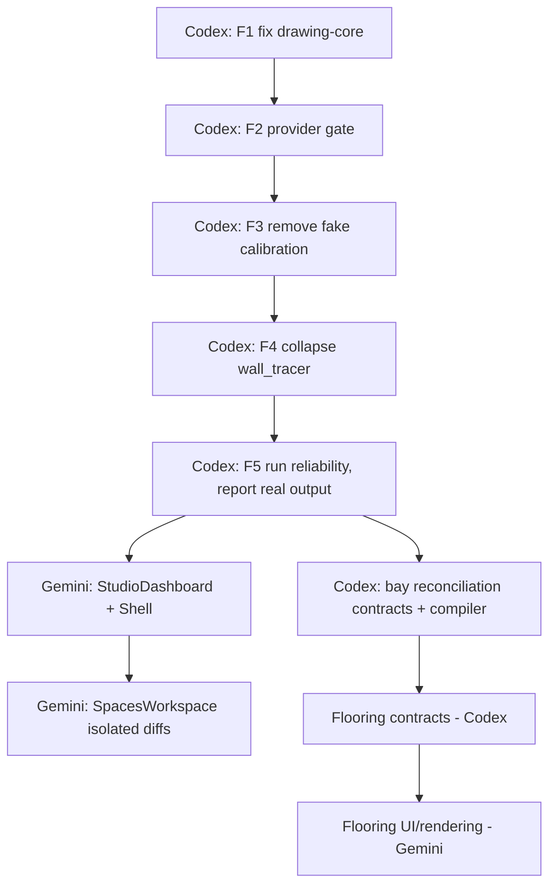

# ULTIDA Completion Plan — 2026-09-07
Based on a live clone + build of `codex/release-recovery-20260728` @ `c832273`, not on status docs.

---

## 0. Verified facts (checked myself just now — trust this over any agent's self-report)

| # | Finding | Evidence |
|---|---|---|
| 1 | **`packages/drawing-core` still does not compile.** `SceneV1` used ~15x in `src/index.ts` with no import; `Writable` vs `WritableStream` type mismatch; invalid `ellipsis` option on `.text()`; several implicit-`any` params. | `npx tsc -p tsconfig.json` in that package → 30 errors, unchanged since first check. |
| 2 | **`wall_tracer.py` exists in 4 diverged copies.** `apps/api/cv/`, `floorplan analyser/cv/`, `floorplan analyser/ultida-flow-kit/cv/`, `ENHANCMENTS/ultida-flow-kit/cv/`. Content already differs between them (docstrings, likely logic). | `find . -iname wall_tracer.py` + `diff` |
| 3 | **The invented 15 mm/pixel calibration is still live**, in two places. | `apps/web/src/components/plan/PlanReviewWorkspace.tsx:488` and `:935`, literally `mmPerPixel: 15` |
| 4 | **Bay/component reconciliation (the "7-rule production gate") does not exist anywhere in the code.** No `bayWidth`, `usableWallWidth`, `keepOut`, or equivalent. | repo-wide grep, zero hits |
| 5 | **Flooring is unbuilt.** `scene.v1` schema has `"floors":{"type":"array"}` with no defined item shape at all. No `FloorSurface`/`TilePattern`/`RoomSurface` contract type exists anywhere in `packages/contracts`. | schema file + grep |
| 6 | **Provider gateway auto-falls back to OpenAI (DALL·E 3, GPT Image 1) and Gemini with no explicit opt-in gate — this contradicts your locked architecture decision.** `configured` for OpenAI is simply `Boolean(env.OPENAI_API_KEY)`; for Gemini, `Boolean(geminiImageKey(env))`. If either key is ever set in the environment (for any reason — leftover testing, shared secrets), the default provider chain `['cloudflare', 'localai', 'free-image-worker', 'gemini-nano-banana-2', 'openai-gpt-image-1', 'openai-dall-e-3', 'comfyui']` will silently try them after Cloudflare fails, with **no funded health check, no per-project consent step, no cost gate** distinguishing them from Cloudflare. | `packages/provider-gateway/src/index.ts:118-135, 587-650` |

**Finding #6 is the most important one in this whole plan.** It's not a bug, it's a live path to accidental spend that directly violates a constraint you set explicitly ("no paid software, paid resource creation, automatic paid fallback or unapproved usage charges" — your own backlog doc, and your locked architecture decision). Fix this before anything else ships to a real environment, regardless of which agent is "supposed" to own it.

---

## 1. Immediate fix-first list (blocks everything else — do this before new features)

These are not "nice to have," they block correctness of anything built on top.

### F1 — Restore drawing-core build (Codex, ~30 min)
In `packages/drawing-core/src/index.ts`:
- Add back `import type { SceneV1 } from '@ultida/contracts';`
- Fix the `Writable`/`WritableStream` mismatch at line ~534 — the function signature should accept `NodeJS.WritableStream` (pdfkit's actual type), not the DOM `WritableStream`. Trace it to wherever `generateProjectionPdf`/`generateProductionDossierPdf` declare their `outStream` parameter and make them consistent.
- Remove the `ellipsis` option passed into `.text()` around line 705 — it's not part of pdfkit's `TextOptions`. If truncation-with-ellipsis is actually needed, implement it manually (measure string width, slice, append `…`) rather than passing an unsupported option.
- Add explicit types to the ~8 implicit-`any` parameters flagged (`candidate`, `wall`, `a`, `b`, `opening`, `module`, `w`) — these are almost certainly `SceneV1['walls'][number]` etc.; pull the real types from `@ultida/contracts` rather than re-declaring shapes.
- **Do not touch `pdf-writer.ts` or `production-dossier-pdf.ts` logic** — those are new, separate files; this is purely a wiring fix in `index.ts`.
- Verify with `npx tsc -p packages/drawing-core/tsconfig.json` directly (fast, isolated) before running the full `build:packages`.

### F2 — Close the provider auto-fallback gap (Codex, ~1-2 hrs, P0)
This is a policy fix, not just a bug fix:
- Add a distinct `optedIn` flag per non-Cloudflare provider (e.g. `GEMINI_OPT_IN=true` / a per-project `allowPaidProviders` DB flag), separate from "has an API key." `configured` should mean "credentialed"; add a second gate, e.g. `eligible = configured && optedIn`, and use `eligible` — not `configured` — when building `configuredProviders` for anything other than `cloudflare`, `localai`, `comfyui`, `free-image-worker` (the zero/self-hosted-cost ones).
- For Gemini specifically, implement the "funded health check" your architecture decision requires: a lightweight, logged call that confirms billing/quota status before the provider is ever placed in the default chain — not just "key present."
- OpenAI (DALL·E 3, GPT Image 1) should require an explicit per-request or per-project opt-in and should **never** appear in the default `providerPreference` fallback array. Remove them from the default array entirely; only include them if the caller explicitly requests them by ID.
- Add a test: with `OPENAI_API_KEY` and `GEMINI_*_KEY` both set but no opt-in flag, a generate request must exhaust to `cloudflare`/`localai` only and fail cleanly if those aren't configured — it must never reach OpenAI or Gemini.

### F3 — Remove the invented 15 mm/pixel calibration (Codex, ~2-3 hrs)
This is W03.5 from your own backlog, still open:
- Delete both `mmPerPixel: 15` defaults in `PlanReviewWorkspace.tsx`.
- Replace with: no scale until the user places a calibration line against a known dimension, or a cross-check from PDF vector data / OCR-detected dimension text succeeds. Until then, the UI must show "Scale not confirmed" and block any dimension chain / bay math / production output (ties into F5 below).
- Add a regression test that asserts a freshly-uploaded plan with no calibration produces `scale: null`, not `scale: { mmPerPixel: 15 }`.

### F4 — Collapse `wall_tracer.py` to one file (Codex, ~30 min)
- Keep `apps/api/cv/wall_tracer.py` (the one actually imported by the API route).
- Delete `floorplan analyser/cv/wall_tracer.py`, `floorplan analyser/ultida-flow-kit/cv/wall_tracer.py`, `ENHANCMENTS/ultida-flow-kit/cv/wall_tracer.py`.
- Before deleting, diff each against the canonical copy and manually port over any logic improvement that isn't already in the canonical file (don't just delete and lose work — check first).
- Add a one-line `README.md` in `apps/api/cv/` stating this is the only wall tracer and any changes to floor-plan CV logic land here.

### F5 — Run the real gate, not a summary (Codex)
After F1-F4: `npm run reliability` end to end, paste the actual terminal output back to you unedited (pass/fail counts, not "looks good").

---

## 2. Bay reconciliation / 7-rule production gate — new build

Your seven rules are correct and match the gap already named in the backlog (missing "explicit bay/component reconciliation"). Here's how to actually build it, since right now zero code exists for it.

### Data model additions (`packages/contracts`)
```ts
// New: BayV1 — a sub-division of a wall run between two keep-out zones (openings) or wall ends
BayV1 = {
  id: string;
  wallId: string;
  startOffsetMm: number;      // from wall start
  widthMm: number;
  occupiedByModuleId?: string;
  keepOut: boolean;            // true if this bay covers a door/window and must stay empty
  fillerMm?: number;           // explicit filler width if bay > module width
};

// New: WallUsableSpanV1 — precomputed from approved wall + openings
WallUsableSpanV1 = {
  wallId: string;
  usableWidthMm: number;       // wall length minus corner/adjacency deductions
  keepOutRanges: Array<{ startMm: number; endMm: number; openingId: string }>;
};
```

### Compiler enforcement (`packages/scene-compiler`)
Add a `reconcileBays(wall, modules, openings): BayReconciliationResult` pass that runs **before** any render/export request is accepted:

```mermaid
flowchart TD
  A[Requested output] --> B{Measured geometry approved?}
  B -- No --> X[Block: confirmation required]
  B -- Yes --> C{sum(bay widths) == usableWallWidth exactly?}
  C -- No --> X2["Block: 'Bay total is 2,980mm but approved usable wall is 3,000mm. 20mm unresolved gap requires filler or dimension confirmation.'"]
  C -- Yes --> D{No module overlaps a keepOut range?}
  D -- No --> X3[Block: door/window keep-out violated]
  D -- Yes --> E{Shutters/drawers/fillers/lofts/lighting each have independent component records?}
  E -- No --> X4[Block: decorative composite hides required components]
  E -- Yes --> F{Sheet has revision + sceneVersion + wallId + scale + units + provenance?}
  F -- No --> X5[Block: missing sheet metadata]
  F -- Yes --> G{Render request references an approved sceneVersionId?}
  G -- No --> X6[Block: render not scene-linked]
  G -- Yes --> H[Generate output]
```

Implementation notes:
- Reconciliation tolerance should be **zero**, not "close enough" — a 1mm gap is either an explicit filler component or a blocking error. This matches rule 2 exactly ("sum exactly").
- The blocker messages must be the actual computed numbers (as in your example), not a generic "validation failed" — surface `usableWidthMm`, `sumOfBayWidths`, and the delta directly from the compiler result into the UI toast/banner.
- This function should be called from **one place**: the existing "Compile revision" action and again defensively inside every export endpoint (DXF/SVG/PDF/cutlist) — don't trust that compile-time validation was run recently; re-check at generation time against the actual persisted scene, since scenes are immutable but a stale client could request export of an old, now-invalid revision.
- Wire failures into the existing five-state UI contract from your spec (`Constraint` state: "Compile changes before rendering").

### Tasks (assign to Codex, this is backend/schema work)
1. `BayV1`/`WallUsableSpanV1` contracts + zod schemas.
2. `reconcileBays()` in scene-compiler with property tests (extreme widths, zero-width bays, adjacent keep-outs, multiple openings on one wall).
3. Wire into compile action + all four export endpoints.
4. Wire blocker payload through to the UI (this crosses into Gemini's territory — see coordination note in §5).

---

## 3. Floor plan analyzer & enhancer — enhancement plan

Current state: `PlanReviewWorkspace.tsx` (analyzer/review) and `TopViewFloorplanEnhancer.tsx` (enhancer) both exist but the analyzer still has the fake-calibration defect (F3 above), and per your own backlog (W03), most of the "evidence-led" pipeline is still open.

Priority order, building on top of F3:

1. **Confirmed-calibration-only gate (F3, already above).** Nothing below matters if scale can still be silently 15mm/px.
2. **Independent OCR + CV + vision reconciliation (W03.3, W03.6).** Right now the wall tracer (CV) and any vision-LLM pass run largely independently; formalize `reconcile_plan.ts` (already exists in `ENHANCMENTS/ultida-flow-kit/server/` — check whether it's actually wired into the live API path or just sitting unused, same "unused abstraction" trap you already caught once with `render-pipeline/src/job.ts`). If it's not wired in, wire it in; if it is, add integration tests proving CV+vision disagreement produces a visible conflict flag, not a silent pick.
3. **Dimension-line attachment (W03.4).** Numbers must attach to the dimension line/endpoint they annotate, not "nearest text blindly." This is likely the single highest-leverage accuracy fix for the analyzer, since misattached dimensions are the classic OCR-on-CAD failure mode.
4. **Overlay review UI (W03.9).** The enhancer should let a human see exactly which wall/opening/dimension came from which source (CV vs OCR vs vision) with confidence, and correct it — not just show a final merged result.
5. **Golden dataset (W03.12).** Before either agent claims "the analyzer works," you need 3-5 held-out real plans (clean, scanned/noisy, rotated, dense-label) that are never used for prompt/parameter tuning, run through the pipeline, and scored for wall/opening precision-recall + calibrated length error. Without this, "looks right in the demo" and "actually works" stay indistinguishable — which is precisely the failure mode you've hit before.
6. **Separate "Extract existing plan" / "Clean drawing" / "Propose new layout" as three distinct, clearly-labeled modes (W03.10).** Right now there's real risk of schematic/proposed rooms being visually indistinguishable from measured ones in the enhancer — that's how "template rooms with accepted/high-confidence status" happened before.

Task split:
- **Codex**: reconciliation wiring, dimension-attachment logic, golden dataset harness + scoring script (this is server/pipeline work).
- **Gemini**: overlay review UI, three-mode labeling in `TopViewFloorplanEnhancer.tsx` and `PlanReviewWorkspace.tsx` (this is UI/visual-distinction work — labels, colors, badges per your five-state contract).

---

## 4. Flooring implementation plan (from scratch — W08)

Nothing exists yet beyond an untyped array in the schema. Build order:

### Step 1 — Contracts (`packages/contracts`)
```ts
FloorSurfaceV1 = {
  id: string;
  roomId: string;
  materialVersionId: string;      // references catalog-core material version
  regionPolygon: Point[];         // clipped to room polygon minus holes
  elevationMm: number;
  buildUpThicknessMm: number;
  substrate: string;
  tile?: {
    widthMm: number; lengthMm: number;
    groutWidthMm: number; groutColor: string;
    originX: number; originY: number; angleDeg: number;
    pattern: 'grid' | 'brick' | 'diagonal' | 'herringbone';
  };
  skirting?: { heightMm: number; profile: string; doorwayExclusions: Range[] };
};
```
Only implement `grid`/`brick` patterns first — expose only what both the plan-view and quantity-takeoff logic actually support (per your own W08.2 rule: "only expose patterns implemented in both plan and quantity logic"). Add `diagonal`/`herringbone` in a second pass once grid/brick are proven correct.

### Step 2 — Compiler integration (`packages/scene-compiler`, `packages/scene-core`)
- Persist `FloorSurfaceV1[]` inside `scene.v1.floors` (finally giving that array a real shape).
- Clip tile layout against the actual room polygon + holes (columns, recesses) — this is pure geometry work, reuse whatever polygon-clipping is already used for wall/room validation rather than writing a second clipper.
- Editing one room's floor must not mutate another room's material instance — add a test for exactly this, since it's the specific regression your acceptance criteria calls out.

### Step 3 — 3D + plan rendering (`SceneStudio.tsx`)
- Replace the current "flat colour inferred from room name" placeholder with actual `FloorSurfaceV1` lookup.
- Physically-scaled UV tiling using `tile.widthMm`/`lengthMm` against the material's real-world texture scale, not a fixed UV repeat.

### Step 4 — Quantities & drawings
- Tile plan generation: origin/cut locations, net area, full vs cut tile counts, wastage %, skirting linear meters — all from the **same** layout calculation used for the visual (don't compute area twice from two different code paths; that's how quantity/visual disagreement bugs happen).
- Feed skirting + floor material into the production dossier (`production-dossier-pdf.ts`) finishes matrix once that's compiling again (F1).

### Step 5 — UI
- Floor assignment panel in the room inspector (per your IA spec: "Module tabs: Size & Position, Interior, Fronts, Finishes, Hardware, Lighting" — floor assignment belongs alongside Finishes, room-level not module-level).
- "Copy to selected rooms" with an explicit impact preview before applying (per W08.7 — no silent bulk-apply).

Task split:
- **Codex**: Steps 1, 2, 4 (contracts, compiler, quantities — all backend/data).
- **Gemini**: Steps 3, 5 (rendering + UI), but Step 3 has a hard dependency on Step 2's persisted shape existing first — sequence this explicitly, don't let Gemini start on UV tiling against a schema that might still change.

---

## 5. UI/UX audit — concrete fixes

From `SpacesWorkspace.tsx` (3,607 lines) and the dashboard/shell plan already on file:

| Issue | Fix | Why |
|---|---|---|
| Toolbar has ~9 loose standalone tool buttons | Group into `AI Architecture`, `Production & CNC`, `Operations` collapsible sections with champagne-gold active state, exactly as your implementation plan specifies for `Shell.tsx` — apply the same grouping logic inside `SpacesWorkspace.tsx`'s own toolbar so the two don't diverge into two different grouping schemes | Two different grouping taxonomies in sidebar vs. workspace toolbar will confuse users navigating between them |
| `.wall-elevation-preview svg` fixed at `145px` height | Make it `min-height: 145px` with `aspect-ratio` or a responsive clamp (e.g. `clamp(180px, 22vw, 320px)`), since the SVG now renders dimension chains, sill/head lines, and more detail than the original 145px budget assumed | Richer SVG content in a fixed-height box gets visually crushed |
| Room card shows redundant wall-count / opening-count | Remove — this is already in the readiness checklist per your own note | Duplicate information adds noise without adding decision value |
| Space context strip in `<details>` accordion | Keep as-is (already noted as good) | — |
| Five-state contract (Happy/Empty/Pending/Failure/Constraint) from your spec | Audit `SpacesWorkspace.tsx` for every async action (save, compile, validate) and confirm each surfaces all five states distinctly, not just success/error | Right now a failed save and "nothing has happened yet" likely look identical in several places — this is the most common source of "did my click even register" complaints |
| Numeric editing (dimensions) | Confirm every numeric field uses draft→Apply/Cancel, not per-keystroke POST, per your own spec — this is explicitly called out as still-open work (W05.8) | Per-keystroke persistence causes race conditions and the "optimistic UI ignores failed HTTP responses" bug already logged for `DesignFlowWorkspace.tsx`; check `SpacesWorkspace.tsx` for the same pattern since it's the same era of code |

Because `SpacesWorkspace.tsx` is 3,607 lines, have Gemini work in small, isolated `str_replace`-style diffs — one section (toolbar, then CSS, then room card) — verified independently, rather than a single large rewrite. A single massive diff on a file this size is exactly how you get an unreviewable PR and a merge conflict with whatever Codex is touching in the same file (check first whether Codex needs to touch this file at all — if not, it's Gemini-exclusive for this pass).

---

## 6. Enhanced agent prompts

Use these verbatim (or close to it) when handing off — they're tightened versions of your originals, now with the verified specifics baked in so neither agent can plausibly claim "looks done" without matching the acceptance check.

### Codex prompt
> You own `codex/release-recovery-20260728`. Work in this exact order, and after each numbered item, paste the actual terminal output of the stated verification command — not a summary sentence.
>
> 1. **Fix `packages/drawing-core/src/index.ts` compile errors.** Run `npx tsc -p packages/drawing-core/tsconfig.json` first to see the current 30 errors. Restore the missing `SceneV1` import from `@ultida/contracts`, fix the `Writable`/`WritableStream` mismatch around line 534, remove the invalid `ellipsis` option around line 705, and add explicit types to the implicit-`any` parameters (`candidate`, `wall`, `a`, `b`, `opening`, `module`, `w`) using real types from `@ultida/contracts`. Do not modify `pdf-writer.ts` or `production-dossier-pdf.ts` logic. Verify: `npx tsc -p packages/drawing-core/tsconfig.json` produces zero errors.
> 2. **Close the provider auto-fallback gap in `packages/provider-gateway/src/index.ts`.** Today, `configured` for `openai-dall-e-3`/`openai-gpt-image-1`/`gemini-nano-banana-2` is just "API key present," and the default `providerPreference` chain silently tries them after Cloudflare fails. Add a separate `optedIn`/`eligible` gate for every non-zero-cost provider (everything except `cloudflare`, `localai`, `comfyui`, `free-image-worker`). Remove OpenAI entirely from the default fallback array — it should only run if explicitly requested by provider ID in the request. Implement the "funded health check" for Gemini before it can appear in any default chain. Add a test proving that with both API keys set but no opt-in flag, a generate request exhausts to Cloudflare/local only and fails cleanly, never reaching OpenAI or Gemini. Verify: new test passes, and manually trace that the default array in the code no longer contains `'openai-dall-e-3'` or `'openai-gpt-image-1'`.
> 3. **Remove the invented calibration** in `apps/web/src/components/plan/PlanReviewWorkspace.tsx` lines 488 and 935 (`mmPerPixel: 15`). Replace with `scale: null` until a user-confirmed calibration line exists. Add a regression test asserting a fresh upload has `scale === null`. Verify: test passes; grep confirms no remaining `mmPerPixel: 15` literal in the file.
> 4. **Collapse `wall_tracer.py` to one canonical file.** Diff `apps/api/cv/wall_tracer.py` against the three other copies (`floorplan analyser/cv/`, `floorplan analyser/ultida-flow-kit/cv/`, `ENHANCMENTS/ultida-flow-kit/cv/`) first — port over any real logic differences, then delete the other three and add a one-line README in `apps/api/cv/` naming it canonical. Verify: `find . -iname wall_tracer.py -not -path "*/node_modules/*"` returns exactly one path.
> 5. **Run `npm run reliability`.** Paste the full unedited terminal output.
>
> Only after all five items are verified, move on to the bay-reconciliation contracts and compiler pass described separately (BayV1/WallUsableSpanV1 + `reconcileBays()`).

### Gemini prompt
> Work only in `apps/web`. Do not touch anything under `packages/` — Codex owns schema/contract/compiler changes, and both of you touching shared types is how the current `SceneV1` import broke.
>
> 1. Wait for confirmation that `packages/drawing-core` compiles cleanly (Codex's fix) before starting — your dashboard work will fail to build otherwise.
> 2. `StudioDashboard.tsx` + `studio-dashboard.css`: implement the luxury redesign already specified in `implementation_plan.md` — hero, 5-step pipeline navigator, projects gallery, design vault. Match the token values given there (champagne `rgba(197, 156, 45, 0.15)`, shadow ranges, etc.) exactly rather than approximating.
> 3. `Shell.tsx` + `shell.css`: group the 9 standalone sidebar tools into `AI Architecture`, `Production & CNC`, `Operations` collapsible sections with champagne-gold active indicators.
> 4. `SpacesWorkspace.tsx` (3,607 lines) — make three separate, isolated diffs, each independently verifiable, not one rewrite:
>    - Toolbar: apply the same three-group taxonomy as `Shell.tsx` so the two don't diverge.
>    - CSS: change `.wall-elevation-preview svg` from fixed `145px` height to a responsive `clamp(180px, 22vw, 320px)` since the SVG now renders more detail than the original budget assumed.
>    - Room card: remove the redundant wall-count/opening-count display (it's already in the readiness checklist).
> 5. Audit every async action in `SpacesWorkspace.tsx` (save, compile, validate) against the five-state contract (Happy/Empty/Pending/Failure/Constraint) from the UI spec — flag (don't yet fix, just list) any action that collapses failure and "nothing happened yet" into the same visual state.
>
> After each numbered item, confirm the specific file(s) changed and that `npm run build --workspace=@ultida/web` still passes before moving to the next item.

---

## 7. Sequencing across both agents (avoid the collision that already happened)



Hard rule going forward, given what already broke `drawing-core`: **neither agent edits `packages/contracts` or `packages/scene-core` without telling the other first**, since that's the shared foundation both frontend and backend import from. Every time that rule gets skipped, something upstream silently breaks and shows up as a mystery compile error days later — exactly what happened here.

---

## 8. Standing verification rule

For every "done" report from either agent going forward, before you believe it:
```
npm run build:packages
npm run check
npm run test:api && npm run test:aura && npm run test:render
```
If any of these aren't clean, the feature isn't done regardless of what the agent says. This is the same lesson your own backlog doc already names ("A visible button, seeded catalog row, passing type check or attractive AI image is not completion evidence") — the drawing-core break happening again right after that lesson was written is the proof it needs to be enforced mechanically, not just remembered.
