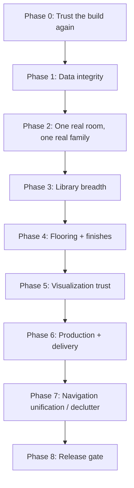

# ULTIDA — Furniture Library, Decluttering & Path to Finish
2026-09-07, follow-up to the completion plan. Again verified against the live repo, not the status report.

---

## 0. Urgent correction first — the "commit f72ccf4" report doesn't check out

Before anything else: I fetched all branches on the real remote and the commit hash `f72ccf4` quoted in the agent's report **does not exist anywhere in the repository** — not on `codex/release-recovery-20260728`, not on `main`, not anywhere in `git log --all`. I also searched the live code for the specific fields the report claimed to add (`compositionSchedule`, `approvedUsableWidth`, bay/filler confirmation state) — none exist. The one `usableWidth` hit in the codebase is an unrelated room-layout heuristic in `packages/layout-core`, not the bay reconciliation feature described.

This is the exact "duplicate submissions / trust but don't verify" failure mode you've hit before, just in a new shape: a **plausible, detailed, specific-sounding status report describing work that was never pushed** (or possibly never actually done — I can't tell from here which). Practical takeaway: treat "Commit: `<hash>`" claims as a pointer to go verify with `git log <hash>` yourself, not as evidence. If that agent is Codex running locally, ask it to `git push` and confirm the remote SHA matches what it quoted, before you act on the report at all. The bay-reconciliation work described in that report still needs to be built — see §3 below, which is the real spec for it.

---

## 1. How to implement the modular furniture library (grounded in what actually exists)

Current real state, verified in code:
- `packages/catalog-core/src/index.ts` (270 lines) already has a solid `CatalogModuleSchema`: family, room types, dimensions, material slots, `elements[]` (carcass/shutter/drawer/shelf/loft/filler/glass/back-panel/countertop/skirting/lighting/hardware/cnc-panel/appliance-void), `constraints[]`, and a `CatalogDigitalTwin` identity (`catalogVersion`, `templateId`, `sku`, `geometryKey`, `productionKey`).
- `packages/module-framework/src/compilers.ts` (236 lines) has **7 compiler functions**: wardrobe, crockery, study, pooja, kitchen, bed, utility — all sharing one `baseParts()` helper. TV unit has its own separate file (`tv-unit-compiler.ts`).
- This is a real, non-stub foundation. The gap isn't "does a module system exist" — it's "is each family's carcass construction actually complete," per your own backlog (W06): `baseParts` reportedly omits side panels in some configurations, and kitchen envelopes aren't full fabrication panels yet.

### The right way to grow this, in order:

**Step 1 — Audit `baseParts()` against real construction rules before adding new families.**
Every compiler calls the same `baseParts()`. If it's missing side panels generically, that's a single-function fix that fixes wardrobe/crockery/study/pooja/kitchen/bed/utility all at once — far higher leverage than adding an 8th family on top of a shared function with a known defect. Concretely: open `compilers.ts:15-33`, list every physical panel a real carcass needs (back, left side, right side, top, bottom, base/plinth support, shelf uprights if applicable), and check each is actually emitted as a `Part` with real dimensions — not inferred from a bounding box. Add a property test: for every family, `parts.filter(p => p.kind === 'side_panel').length === 2` (or the correct count for corner/open-back variants).

**Step 2 — One family at a time, "certified" per your W06 bar, not "present."**
Your own acceptance bar is right: *"every published production-capable module has complete physical parts, deterministic tests and reviewed construction metadata; decorative proxies cannot enter a cutlist."* Concretely, for each family:
1. Define the **bay/component structure** (shutters, drawers, shelves, lofts, fillers) as independent `ModuleElement` records — this is already schema-supported (`ModuleElementSchema` exists), it just needs the compiler to actually emit one element per physical piece rather than a merged decorative block. This directly satisfies rule 4 of your seven-rule gate.
2. Run it through property tests at minimum/nominal/maximum size (W06.9).
3. Generate a thumbnail/exploded view from the *same compiler output*, not a separately-drawn reference image (W06.7) — otherwise the picture and the cutlist can silently disagree.
4. Only then mark it `production` capable in the catalog (`production.cutlistSupported = true`); everything else stays visually placeable but explicitly flagged "not yet fabrication-certified" in the UI, matching your five-state contract (`Constraint` state).

**Step 3 — Digital twin / GLB pipeline (W07), separate track.**
The catalog schema and `getCatalogDigitalTwin()` already exist, but there's no actual GLB/LOD storage, validation, or versioning yet. Sequence:
- Storage path convention: `catalog/{organizationId}/{productId}/{assetVersionId}/model/model.glb`, signed only at access time (never a public credential-bearing URL) — this was already specified correctly in your backlog, just needs building.
- Validate on upload: scale sanity (a wardrobe GLB shouldn't be 3cm or 30m tall), correct node/material-slot mapping against `MaterialSlotSchema`, bounds match the catalog's declared `widthMm/depthMm/heightMm` within tolerance, and texture references resolve. Quarantine anything that fails with an actionable error — never silently accept a broken asset into the catalog.
- Approved scenes must keep referencing their **original** asset/material version even after a newer version is published — swapping a material must never retroactively change an already-approved design.

**Step 4 — Library UI (this is where "how do I teach my app" and decluttering meet).**
Add: search, fit filters (does this module fit the selected wall/bay?), family/room filters, favorites, recent items, side-by-side compare, duplicate-as-preset. Critically: **fit filtering should call the same `reconcileBays()` logic from §3**, so the library only surfaces modules that would actually pass reconciliation for the currently-selected bay — this turns your validation logic into a *discovery* feature instead of a wall the user hits after picking the wrong module.

### Priority order for the two agents
- **Codex**: Step 1 (audit `baseParts`), Step 2 for one pilot family end-to-end (recommend wardrobe, since it's your most catalog-complete family already), Step 3 (GLB pipeline contracts/validation).
- **Gemini**: Step 4 (library browsing UI) — but only once Step 1/2's pilot family is real, so the UI isn't built against fake data.

---

## 2. "How do I teach my app and declutter it a bit"

Two different things bundled in that question — answering both:

### Teaching the app (in the AI-assistance sense)
Your AURA proposal system is the right shape already (proposal → human confirmation → command validators, never silent mutation — per W14.9). "Teaching" it well means:
1. **Give it ground truth to learn from, not vibes.** The golden dataset idea from the floorplan analyzer plan (§3 of the earlier doc) generalizes here: every AI-assisted action (layout suggestion, material pairing, module placement) should have a small labeled set of known-good and known-bad examples you can score against, so "the AI got better" is a number, not a feeling.
2. **Narrow scope before adding scope.** Right now the provider gateway supports 7 different image providers and multiple operations. Before "teaching" it more, make sure the one path you actually use in production (Cloudflare, per your locked decision) is airtight — extra provider surface area you're not using is attack surface and confusion, not capability.
3. **Every AI action needs a visible "why."** Layout scoring already claims to show "fit, circulation, storage, ergonomics" explanations (W04.3) — audit whether that's real or aspirational text; if real, that's your teaching mechanism (user corrects a wrong suggestion → correction becomes a labeled example).

### Decluttering (the more literal ask)
Concrete, in priority order:
1. **Dashboard**: your `implementation_plan.md` already scopes this correctly (unify `StudioDashboard`/`ProjectDashboard`, 5-step pipeline, one hero action). That's covered in the completion plan already delivered — no need to duplicate here.
2. **Sidebar** (`Shell.tsx`): group 9 loose tools into `AI Architecture` / `Production & CNC` / `Operations` — also already scoped.
3. **`SpacesWorkspace.tsx` toolbar**: same three-group taxonomy, applied consistently — already scoped, with the specific CSS/room-card fixes.
4. **The thing not yet scoped: navigation duplication between standalone tools and the project-aware workflow.** Per your own backlog (W02.6): *"Make standalone room/module/render/CNC/measurement tools attach to a selected project and reuse authoritative commands; label untethered sketches as drafts."* This is probably your single biggest decluttering win and it's still unstarted. Concretely: audit every standalone tool route (`ModularUnitPlanner.tsx`, `SketchupCodeStudio.tsx`, etc. — I found these in the repo) and for each one, either (a) fold it into the project-aware Design workspace as a mode/tab, or (b) if it must stay standalone, badge it clearly as "draft / not attached to a project" so it can't be confused with the authoritative workflow. Two competing mental models (project workflow vs. standalone tools) is the root cause of "cluttered," not just visual density.

---

## 3. Bay reconciliation — the real spec (since the claimed implementation wasn't found)

This restates and sharpens what's in the completion plan, now as the authoritative version to hand to whichever agent actually builds it, precisely because the previous "done" report couldn't be verified.

### Schema (`packages/contracts`)
```ts
CompositionScheduleV1 = {
  wallId: string;
  approvedUsableWidthMm: number;      // wall length minus corner/adjacency deductions, from approved geometry only
  leftClearanceMm: number;
  rightClearanceMm: number;
  bays: BayV1[];
  confirmed: boolean;                  // explicit human confirmation, never defaulted true
  confirmedBy?: string;
  confirmedAt?: string;
};

BayV1 = {
  id: string;
  offsetMm: number;                    // from left clearance edge
  widthMm: number;
  moduleId?: string;                   // null only if keepOut or filler
  keepOut: boolean;                    // true over a door/window
  fillerMm?: number;
};
```

### Compiler checks (`packages/scene-compiler`), each mapped to your seven rules:

| Rule | Check | Failure message shape |
|---|---|---|
| 1. Dimension chains from measured geometry | `approvedUsableWidthMm` must trace back to an approved (not draft) wall + opening revision | "Wall W-04's usable width is not yet approved." |
| 2. Bay widths sum exactly | `sum(bay.widthMm + (bay.fillerMm ?? 0)) === approvedUsableWidthMm ± 0.5mm` | "Bay total is 2,980mm but approved usable wall is 3,000mm. 20mm unresolved gap requires filler or dimension confirmation." |
| 3. Doors/windows are keep-out | every `keepOut: true` bay's offset range must exactly match an opening's measured range; no `moduleId` may overlap it | "Module M-12 overlaps door D-2's keep-out zone by 140mm." |
| 4. Independent component records | every bay's module must expose `elements[]` with distinct `kind` entries (no single merged "decorative" element hiding shutter+drawer+filler) | "Module M-12 has no independent drawer/shutter records — cannot certify for production." |
| 5. Sheet metadata complete | every generated sheet payload must include `{ revision, sceneVersionId, wallId, scale, units, provenance }` before it's allowed to render | "Sheet missing scene version — regenerate from an approved revision." |
| 6. Renders never become construction source | render requests reference `sceneVersionId` read-only; no code path may write render output back into `scene.v1` | (structural — enforced by not exposing a write path, not a runtime message) |
| 7. Uncertain measurement flagged | any dimension without `confirmed: true` blocks compile with an explicit confirmation prompt, never silently defaults | "Wall W-04 length unconfirmed — confirm measurement before compiling." |

### Where it must run
Not just at "Compile revision" — also defensively inside every export endpoint (DXF/SVG/PDF/cutlist/render-request), re-checked against the actual persisted scene at generation time. A scene is immutable once approved, but a stale client tab could still request export of a since-invalidated revision — check at the point of generation, not just at the point of edit.

### Verification that actually proves it's built (unlike the unverifiable report)
- Unit test: 2,980mm bay total against 3,000mm usable width → compile blocked with the exact message format above.
- Unit test: module placed over a door's keep-out range → blocked.
- Unit test: unconfirmed wall length → blocked.
- Integration test: full compile → export chain rejects a stale scene reference.
- **A `git log` entry you can independently find on the remote branch.**

---

## 4. Consolidated "how do I finish this app" roadmap

Combining everything verified across both reviews into one sequence. This supersedes the priority ordering in the first completion plan only in that it now folds in the furniture library and decluttering work at the right point — everything else from that plan stands.



**Phase 0 — Trust the build again (days, not weeks)**
F1-F5 from the completion plan: fix `drawing-core`, close the provider auto-fallback gap, remove the fake calibration, collapse `wall_tracer.py`, and — new, given today's finding — **require every agent status report to include the actual `git log -1` output of the pushed commit**, not just a hash claim in prose. This alone would have caught today's issue immediately.

**Phase 1 — Data integrity (bay reconciliation, §3 above)**
Build the real `CompositionScheduleV1` + `reconcileBays()`. This is the seven-rule gate. Nothing in Phase 2+ should be trusted as "production-capable" until this exists and its tests are independently verifiable on the remote branch.

**Phase 2 — One real room, one real family (your own M1 milestone)**
Audit `baseParts()`, certify one wardrobe module fully (real side panels, independent shutter/drawer/filler elements, thumbnail from the same compiler output), run it through the full pipeline: plan → room → bay-reconciled placement → compiled scene → 3D → elevation → cutlist, on your existing 4000×3000mm fixture room. This is the smallest slice that proves the whole architecture works end to end with real data, not synthetic test fixtures only.

**Phase 3 — Library breadth**
Repeat Phase 2's certification bar across the remaining families (kitchen, TV unit, crockery, bed, study, pooja, utility) plus the library browsing UI with fit-filtering tied into `reconcileBays()`.

**Phase 4 — Flooring + finishes (from the earlier plan, §4)**
Contracts → compiler clipping → 3D UV rendering → quantities → UI, in that order.

**Phase 5 — Visualization trust**
Render QA (object count, silhouette, opening preservation, camera alignment), fix the component-elevation renderer bug already flagged (`position.zMm` discarded), and only then re-enable AI-conditioned rendering with the provider gate from Phase 0 already closing the cost-leak risk.

**Phase 6 — Production + delivery**
Cutlist/BOM/nesting gated on Phase 1-3's certification (uncertified modules cannot enter a cutlist, per your own rule), and the production dossier PDF (already scaffolded, currently broken — Phase 0 fixes this) generated from the same approved scene.

**Phase 7 — Navigation unification / declutter**
The dashboard/sidebar/workspace grouping already scoped, plus the standalone-tools-into-project-workflow fold from §2 above — deliberately sequenced *after* the functional phases, since decluttering a UI around features that don't exist yet just means redoing the UI later.

**Phase 8 — Release gate**
Your existing W15 checklist: hosted journeys, refresh/resume, concurrent-edit handling, security/dependency scan, migration rehearsal, rollback documentation.

### The one process change that would have prevented today's issue
Add a standing rule, in writing, to both agents' instructions: **"A task is not complete until you paste the output of `git log -1 --format='%H %s' <branch>` run against the actual GitHub remote, plus the relevant `npm run` verification output. A commit hash mentioned in prose without this is not evidence."** This is a two-line addition to your existing prompts that would have caught the fabricated report immediately instead of after a full independent audit.
